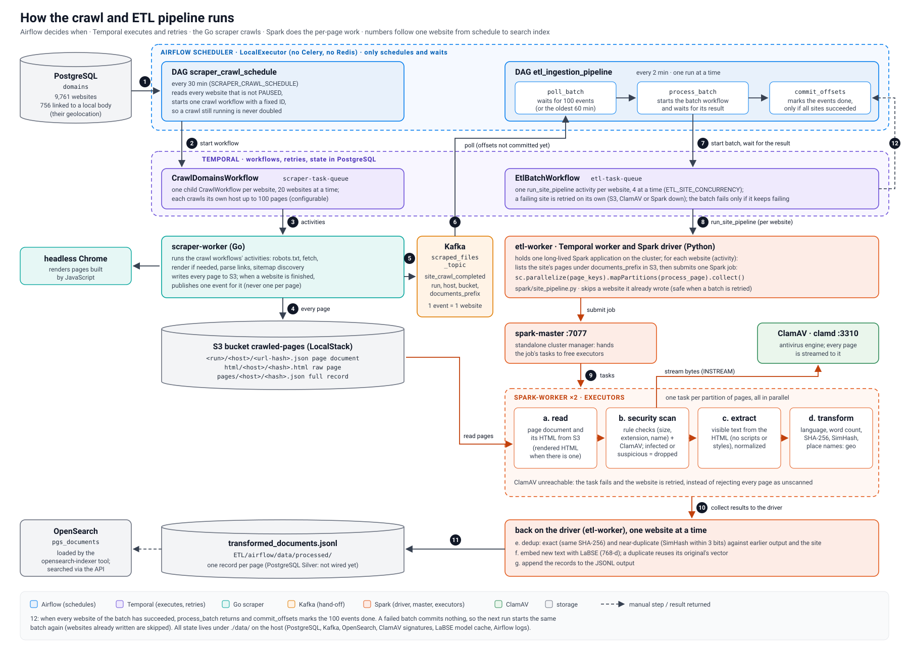

# ETL

ETL for a Nepali/English search engine. Airflow schedules, Temporal executes, Spark
computes, PostgreSQL keeps the result:

- every 30 minutes Airflow starts a crawl of every website in the `domains` table on
  Temporal (the Go scraper worker runs it);
- each website whose crawl finishes sends one `site_crawl_completed` event to Kafka;
- once 100 events have accumulated (or the oldest has waited an hour), Airflow hands the
  batch to Temporal, whose ETL worker is the Spark driver. Per site: on the Spark
  cluster, read every page from S3, security scan (rule checks + ClamAV, fail closed),
  extract and normalize the text; on the driver, LaBSE embeddings and the save to
  PostgreSQL Bronze + Silver through `pgs_db` (dedup, the domain's location, embeddings);
- the search indexer (`search-engine/`) copies the saved pages into OpenSearch.

The system-wide picture, contracts and failure behavior are in
[`docs/ARCHITECTURE.md`](../docs/ARCHITECTURE.md).



(The diagram predates the PostgreSQL output: where it shows the JSONL file and the
OpenSearch indexer tool, the pipeline now saves to PostgreSQL Silver and the search
indexer copies Silver into OpenSearch.)

## Layout

| Path | Contents |
| --- | --- |
| `airflow/dags/` | `scraper_crawl_schedule`, `etl_ingestion_pipeline`, `pgs_db_maintenance_dag.py` (the `pgs_db_jobs_*` DAGs) |
| `temporal/` | `EtlBatchWorkflow` (`etl_workflows.py`), its activities (`etl_activities.py`), the worker (`worker.py`) and the workflow tests |
| `spark/` | the per-site pipeline: `site_event.py` (event validation), `site_pipeline.py` (driver + Spark tasks), `transform.py` (text), `security_scanner.py` (rule checks + ClamAV), `embeddings.py` (LaBSE), and their tests |
| `requirements.txt`, `constraints.txt` | the processing environment's direct and pinned dependencies |
| `Dockerfile` | one image for Airflow, the ETL worker and the Spark cluster |

## Workflow

```text
etl_ingestion_pipeline (Airflow, every 2 min, one run at a time)
  poll_batch      Kafka scraped_files_topic, group etl-ingestion-pipeline: up to
                  ETL_BATCH_SIZE events from the committed offsets, validated
                  (site_event.validate_event); skips until the batch is full or the
                  oldest event waited ETL_BATCH_MAX_WAIT_MINUTES
  process_batch   EtlBatchWorkflow on Temporal (ID = the offset range: a retried task
                  re-attaches to the running workflow) and wait for it
  commit_offsets  only after the workflow succeeded

EtlBatchWorkflow (Temporal, etl-task-queue): one run_site_pipeline activity per site,
  ETL_SITE_CONCURRENCY at a time, heartbeat every 30 s (timeout 2 min), retried with
  backoff. A site still failing after ETL_MAX_SITE_ATTEMPTS with its dependencies healthy
  is dead-lettered to error_logs (with its event) and the batch completes -- unless every
  site failed, or a dependency stayed down: then the batch fails and is retried later.

run_site_pipeline (etl-worker = Spark driver):
  marker <prefix>/_etl/<run>/<host>.json exists -> skip (already done)
  ClamAV PING + PostgreSQL check -> list the site's Document JSON objects
  Spark tasks, ETL_PAGE_GROUP_SIZE pages per job: read Document + HTML, intake checks +
    ClamAV ("cannot scan" fails the run), decode (declared charset), extract the main
    text (without nav/header/footer when the page has enough content), NFC-normalize,
    language, SHA-256, SimHash
  driver: LaBSE (pinned revision) in batches -> pgs_db.etl.save_transformed per page
    (Bronze crawl_runs/crawled_documents + Silver pages/page_embeddings/geo tags);
    rejected pages -> error_logs (SECURITY); corrupt pages -> error_logs, counted
  write the marker with the site's summary
```

Re-running a site is safe: Silver upserts pages by canonical URL, embeddings and Bronze
rows are upserts too, and the marker skips finished sites.

## Environments

The image has two Python environments, because Airflow 2.10 needs SQLAlchemy < 2 and
`pgs-db` needs SQLAlchemy 2:

- Airflow's own: Airflow, `temporalio`, `kafka-python` -- what the DAGs import. DAGs do
  scheduling only; the `pgs_db_jobs_*` DAGs run `/opt/etl-venv/bin/python -m pgs_db.jobs`
  as a subprocess (role `pgs_jobs`).
- `/opt/etl-venv`: `pgs-db`, PySpark, torch (CPU), sentence-transformers, boto3, clamd,
  temporalio. The ETL worker runs with it and it is the interpreter of the Spark
  executors (`PYSPARK_PYTHON`, `SPARK_HOME` point into it).

## Run it

From the repository root (see the root README): `docker compose up -d --build` starts
Airflow, Temporal, Kafka, ClamAV, the Spark cluster and the ETL worker; add the `scraper`
profile for the crawler and S3, and `search` for the indexer and the search engine.

- Airflow UI: http://localhost:8080 (`AIRFLOW_ADMIN_USERNAME` / `AIRFLOW_ADMIN_PASSWORD`)
- Temporal UI: http://localhost:8233 -- `EtlBatchWorkflow` runs, activities, retries
- Spark master UI: http://localhost:8090
- Crawl now: `docker compose exec airflow-scheduler airflow dags trigger scraper_crawl_schedule`
- End-to-end check: `tests/e2e/run_e2e.sh`

The LaBSE model (~1.8 GB) downloads once into `./data/etl-models`.

## Tests

```bash
# in the ETL image (PySpark, Java, the processing environment)
docker run --rm -v "$PWD/ETL/spark:/work" -w /work --entrypoint /opt/etl-venv/bin/python \
    pgs-search-engine/etl:local -m unittest discover -p 'test_*.py'
docker run --rm -v "$PWD/ETL/temporal:/work" -w /work -e HOME=/tmp \
    --entrypoint /opt/etl-venv/bin/python pgs-search-engine/etl:local -m unittest test_etl_workflows
# the real LaBSE contract (768-d, normalized, cross-lingual): RUN_LABSE_TESTS=1
```

## Known gaps

- **HTML pages only.** Documents and images the scraper finds are not extracted (the
  former per-file PDF path was removed with the per-file hand-off); `stored_files` and
  `pgs_db.etl.process_stored_file_batch` are ready for it.
- **Location from the domain only.** A page is geo-tagged with its site's local body
  (government sites); tagging pages by the places they mention (the gazetteer in
  `pgs_db.ReferenceRepository.gazetteer`) is not implemented.
- **One vector per page**: the mean of its first 16 LaBSE windows; no passage vectors.
- **Embeddings on the driver**: one LaBSE instance per ETL worker (memory-bound on small
  machines); scaling out means more ETL workers on the same task queue.
- **Malware is logged, not quarantined**: infected pages are rejected and logged
  (`error_logs`, `INFECTED`); they are not moved to a quarantine bucket or recorded in
  `quarantined_files`.
